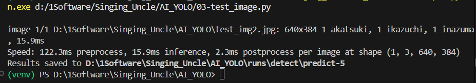
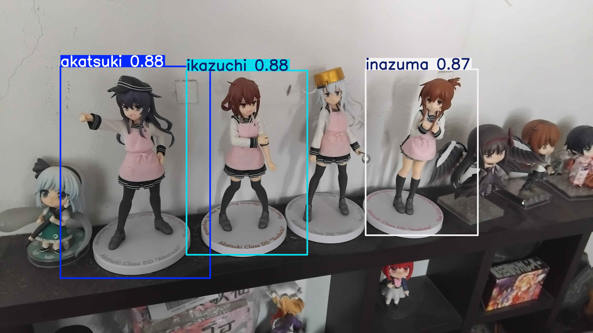
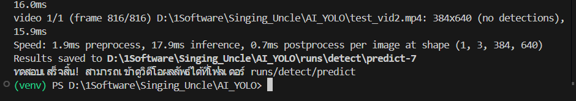
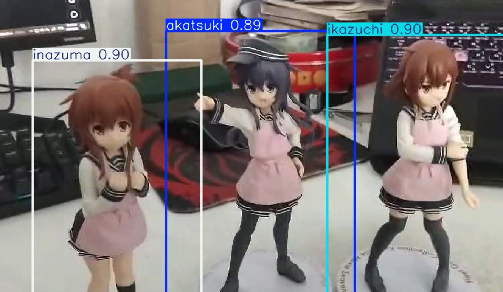
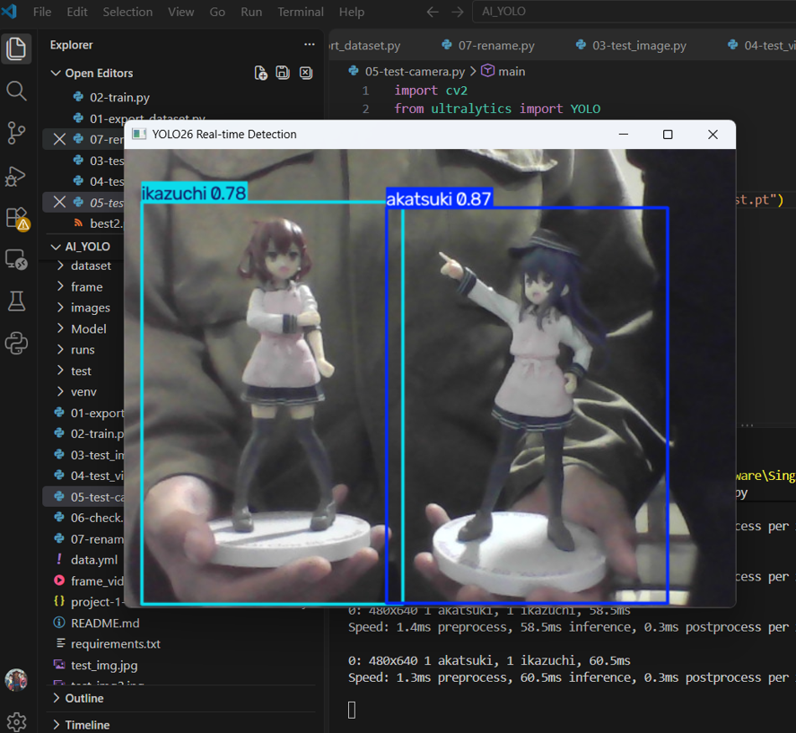

# YOLO26 - Kantai Collection Figurines Detection

โปรเจกต์ Object Detection สำหรับตรวจจับ figure ตัวละครจากเรื่อง Kantai Collection 3 ตัว ได้แก่ Akasuki, Ikuzachi และ Inazuma โดยใช้ YOLO26

---

##  Project Overview

วัตถุประสงค์ของโปรเจกต์คือการพัฒนาโมเดล Computer Vision สำหรับตรวจจับ figure จากภาพ โดยแบ่งวัตถุออกเป็น 3 Class

| ID | Class |
|---:|---|
| 0 | akasuki |
| 1 | ikazuchi |
| 2 | inazuma |

---

##  Features

-  ตรวจจับ Akasuki, Ikuzachi และ Inazuma 
-  Object Detection ด้วย Bounding Box
-  ตรวจจับวัตถุจากรูปภาพ
-  ตรวจจับวัตถุแบบ Real-time ผ่าน Webcam
-  รองรับ Dataset ที่เตรียมจากการทำ Annotation
-  Train และ Validate ด้วย Ultralytics YOLO
-  มีโมเดลที่ Train แล้วใน `Model/best.pt`

---

#  Technology Stack

| Technology | ใช้สำหรับ |
|---|---|
| Python | พัฒนาโปรแกรม |
| YOLO26 | Object Detection |
| Ultralytics | Training และ Inference |
| OpenCV | ประมวลผลภาพและ Webcam |
| PyTorch | Deep Learning |
| Label Studio | ทำ Annotation / Bounding Box |

---

#  Project Structure

โครงสร้างไฟล์ปัจจุบันของโปรเจกต์:

```text
AI_YOLO/
│
├── dataset/
├── images/
├── Model/
├── runs/
├── test/
├── venv/
├── .gitignore
├── 01-export_dataset.py
├── 02-train.py
├── 03-test_image.py
├── 04-test_video.py
├── 05-test-camera.py
├── 06-check.py
├── 07-rename.py
├── data.yml
├── frame_vid.mp4
├── project-1-at-2026-0....json
├── README.md
├── requirements.txt
├── test_img.jpg
├── test_img2.jpg
├── test_vid.mp4
├── test_vid2.mp4
└── yolo26n.pt
```

## รายละเอียดไฟล์

| File / Folder | Description |
| :--- | :--- |
| `dataset/` | Dataset ที่ใช้ในโปรเจกต์ |
| `images/` | รูปภาพที่ใช้สำหรับ Dataset หรือทดสอบ |
| `Model/` | โฟลเดอร์เก็บโมเดล YOLO ที่ Train แล้ว |
| `runs/` | ผลลัพธ์และ logs จากการ Training |
| `test/` | ไฟล์สำหรับทดสอบโมเดล |
| `venv/` | Python virtual environment |
| `01-export_dataset.py` | เตรียมและแปลง Dataset |
| `02-train.py` | ใช้สำหรับ Training Model |
| `03-test_image.py` | ทดสอบ Model กับรูปภาพ |
| `04-test_video.py` | ทดสอบ Model กับไฟล์วิดีโอ |
| `05-test-camera.py` | ตรวจจับวัตถุผ่าน Webcam แบบ Real-time |
| `06-check.py` | ตรวจสอบ Dataset หรือ Model |
| `07-rename.py` | เปลี่ยนชื่อไฟล์ใน Dataset |
| `data.yml` | กำหนด Dataset และ Class สำหรับ YOLO |
| `frame_vid.mp4` | วิดีโอตัวอย่างสำหรับทดสอบ |
| `project-1-at-2026-0....json` | ไฟล์ annotation จาก Label Studio |
| `README.md` | เอกสารอธิบายโปรเจกต์ |
| `requirements.txt` | รายการ Python packages ที่จำเป็น |
| `test_img.jpg` | รูปภาพสำหรับทดสอบ #1 |
| `test_img2.jpg` | รูปภาพสำหรับทดสอบ #2 |
| `test_vid.mp4` | วิดีโอสำหรับทดสอบ #1 |
| `test_vid2.mp4` | วิดีโอสำหรับทดสอบ #2 |
| `yolo26n.pt` | YOLO pretrained weights ที่ใช้เป็น base model |
| `.gitignore` | กำหนดไฟล์ที่ไม่ต้องการให้ Git ติดตาม |

# 🧪 Test Model

## 1. Test Image

เปิดไฟล์

```text
03-test_image.py
```

แก้ชื่อไฟล์ภาพที่ต้องการทดสอบ

```python
results = model.predict("FILE_NAME", conf=0.01, save=True)
```

จากนั้นรัน

```bash
python 03-test_image.py
```




ผลลัพธ์จะถูกบันทึกโดยระบบ Ultralytics และสามารถดูภาพที่ตรวจจับแล้วได้



---

# 🎥 2. Test Video

ไฟล์ที่ใช้ทดสอบคือ

```text
04-test_video.py
```

กำหนดไฟล์วิดีโอ เช่น

```python
video_to_test = "video_candy1.MOV"
```

รันคำสั่ง

```bash
python 04-test_video.py
```



ผลลัพธ์จะถูกบันทึกไว้ใน

```text
runs/detect/predict
```



---

# 📷 3. Test Camera

สำหรับการตรวจจับวัตถุแบบ Real-time ผ่านกล้อง Webcam ใช้ไฟล์

```text
05-test-camera.py
```

รันด้วย

```bash
python 05-test-camera.py
```

ระบบจะเปิดกล้องและแสดงผลการตรวจจับแบบ Real-time



กด

```text
q
```

เพื่อออกจากโปรแกรม

---

# ⚠️ Notes

* ต้องตรวจสอบ Path ในไฟล์ Python ให้ตรงกับตำแหน่งไฟล์จริงในเครื่อง
* `01-export_dataset.py` ต้องมีไฟล์ JSON ที่ Export จาก Label Studio อยู่ในโฟลเดอร์เดียวกัน
* ภาพที่ใช้ Label ต้องตรงกับภาพที่ระบุใน JSON
* ควรใช้ Class เฉพาะที่มีอยู่จริงใน Dataset
* ก่อน Train ควรตรวจสอบว่า `data.yml` ชี้ไปยัง Dataset ที่ถูกต้อง
* หากใช้ GPU ต้องตรวจสอบว่า PyTorch และ CUDA สามารถทำงานร่วมกับอุปกรณ์ของเครื่องได้
* หากไม่มี GPU สามารถปรับ `device` ในไฟล์ Training ให้เหมาะสมกับเครื่อง


